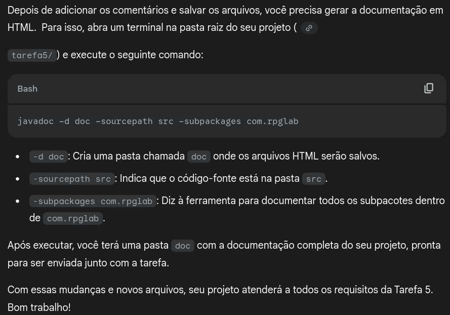

# Simulação de RPG

Nesta simulação, os personagens Mario e Luigi devem se aventurar pelo castelo do vilão Bowser, a fim de salvar a princesa Peach. Para isso, foi simulado um jogo com três monstros -
Bowser, King Boo e Kame- e os dois heróis. Para deixar a simulação mais interessante, foi implementado uma narrativa, juntamente com os elementos de combate e habilidades, elementos
essenciais em jogos RPG.

1 cd tarefa2
2 javac -d bin $(find src -name "*.java")
3 java -cp bin Main

# 1. Compilar o cdigo fonte:
2 # Este comando compila todos os arquivos .java dentro da pasta ’src’
3 # e coloca os arquivos .class resultantes na pasta ’bin’,
4 # mantendo a estrutura de pacotes.
5 javac -d bin -sourcepath src $(find src -name "*.java") -sourcepath test $(find test -name "*.java")
6
7 # 2. Executar o programa:
8 # Este comando executa a classe Main, informando ao Java para
9 # procurar as classes compiladas a partir da pasta ’bin’.
10 java -cp bin com.rpglab.game.Main
11
12 # 3. Executar os testes:
13 # Este comando executa os testes utilizando o JUnit standalone.
14 # Note: Bibliotecas ("/lib") NO devem ser includas no git.
15 java -jar lib/junit-standalone-1.13.4.jar --class-path . --scan-classpath

javadoc -d doc -sourcepath src -subpackages com.rpglab

# Instalar JUnit no sistema via SDKMAN
curl -s "https://get.sdkman.io" | bash
source "$HOME/.sdkman/bin/sdkman-init.sh"

# Não tem como instalar JUnit direto, mas podemos configurar o CLASSPATH
# Baixar JUnit para um local permanente
sudo mkdir -p /usr/share/java
sudo wget -O /usr/share/java/junit-platform-console-standalone.jar https://repo1.maven.org/maven2/org/junit/platform/junit-platform-console-standalone/1.10.1/junit-platform-console-standalone-1.10.1.jar

# Adicionar ao CLASSPATH permanentemente
echo 'export CLASSPATH=/usr/share/java/junit-platform-console-standalone.jar:$CLASSPATH' >> ~/.bashrc
source ~/.bashrc
